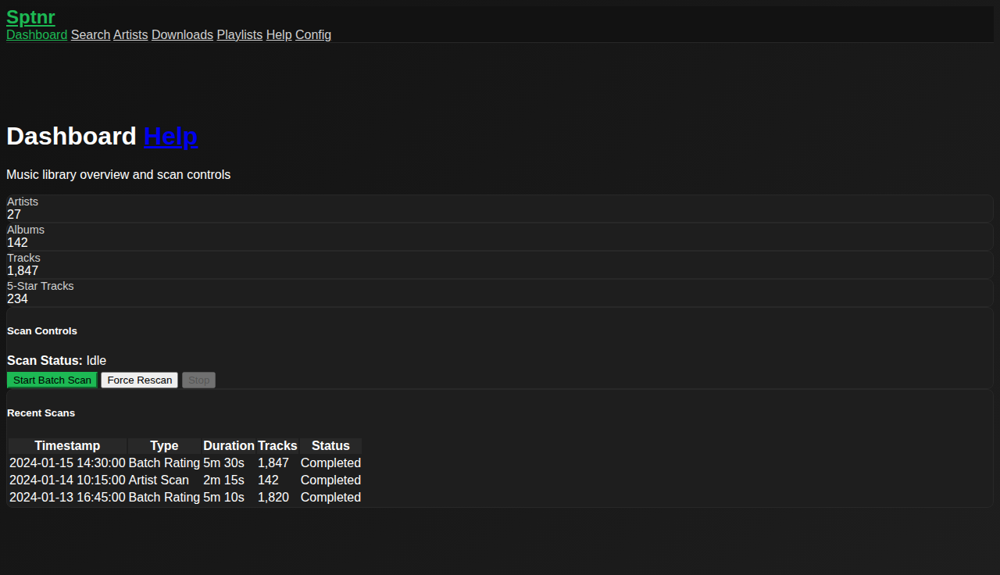

# Dashboard & Overview

The SPTNR dashboard provides a comprehensive overview of your music library and scanning status.

## Accessing the Dashboard

- **URL**: http://localhost:5000 or http://localhost:5000/dashboard
- **Navigation**: Click "Dashboard" in the top navigation bar

## Dashboard Sections

### 📊 Statistics Cards

Four main statistics are displayed at the top:

#### Artists
- Total number of unique artists in your library
- Click to navigate to the Artists page
- Updates in real-time after scans

#### Albums
- Total number of albums across all artists
- Includes all album types (studio, compilation, singles)
- Click to search/filter albums

#### Tracks
- Total number of individual tracks
- Includes all tracks from all albums
- Updates after rating scans

#### 5-Star Tracks
- Count of tracks rated 5 stars
- Useful for creating "best of" playlists
- Indicates highly-rated content

#### Singles
- Number of tracks identified as singles
- Detected using metadata and API data
- Used for single-specific playlists

### 🎛️ Scan Controls

Control and monitor rating scans from the dashboard.

#### Scan Status Indicator
- **Idle (Gray)**: No scan running
- **Running (Green/Animated)**: Scan in progress
- **Stopped (Red)**: Scan was manually stopped
- Shows current operation and progress

#### Scan Buttons

**Start Batch Rating Scan**
- Begins a full library rating scan
- Rates all artists and tracks
- Uses cached data when available
- Button disabled while scan is running

**Force Rescan All**
- Clears cache and rescans everything
- Useful after configuration changes
- Takes longer than normal scan
- Use sparingly to preserve API quota

**Stop Scan**
- Gracefully stops a running scan
- Saves progress made so far
- Can resume later from last checkpoint
- Only enabled when scan is running

### 📝 Recent Scans

Shows the history of recent rating scans.

#### Information Displayed
- **Timestamp**: When the scan occurred
- **Type**: Batch rating, artist scan, force rescan
- **Duration**: How long the scan took
- **Tracks Processed**: Number of tracks rated
- **Status**: Completed, stopped, failed

#### Table Features
- Sortable by clicking column headers
- Shows last 10 scans by default
- Paginated if more than 10 scans
- Auto-refreshes when new scans complete

### 🔄 Real-time Updates

The dashboard updates automatically:
- Statistics refresh every 30 seconds
- Scan status updates every 5 seconds
- Recent scans update on completion
- No page reload required

## Dashboard Features in Detail

### Quick Actions

From the dashboard, you can:
1. **Start a Scan**: Begin rating your library
2. **Monitor Progress**: Watch scan status in real-time
3. **View Statistics**: See library metrics at a glance
4. **Navigate**: Jump to Artists, Albums, or Settings
5. **Check History**: Review past scan operations

### Best Practices

**Regular Scans**
- Run batch rating scans weekly for new content
- Use force rescan after major library changes
- Let scans complete for accurate statistics

**Monitoring**
- Check recent scans for errors or failures
- Watch for API rate limit warnings in logs
- Verify track counts match your library

**Performance**
- Batch scans use caching for speed
- Force rescans take significantly longer
- Stop scans if you need immediate access

## Dashboard Customization

### Statistics Display
Currently shows fixed metrics. Future versions may include:
- Configurable stat cards
- Custom date ranges
- Graph visualizations
- Export to CSV

### Scan Scheduling
For automated scans, use CLI with cron/systemd:
```bash
# Cron example: Daily at 2 AM
0 2 * * * cd /path/to/sptnr && python start.py --batchrate --sync
```

Or use perpetual mode:
```bash
python start.py --perpetual --batchrate --sync
```

## Screenshots

### Main Dashboard View

- Shows all statistics cards
- Scan controls visible
- Recent scans table

### Scan in Progress

- Status indicator shows "Running"
- Progress information displayed
- Stop button enabled

### After Scan Complete

- Updated statistics
- New entry in recent scans
- Status returned to "Idle"

## Related Documentation

- [Web UI Guide](WEB_UI_README.md) - Complete web interface documentation
- [Star Rating Algorithm](STAR_RATING_ALGORITHM.md) - How ratings are calculated
- [Scan History](SCAN_HISTORY_IMPLEMENTATION.md) - Technical details on scan tracking

## Troubleshooting

### Statistics Not Updating
- Wait for scan to complete
- Refresh browser (Ctrl+R / Cmd+R)
- Check database connection in logs
- Verify `/api/stats` endpoint works

### Scan Won't Start
- Check if another scan is running
- Review logs for errors
- Verify Navidrome connection
- Ensure API keys are configured

### Recent Scans Empty
- No scans have been run yet
- Database was recently cleared
- Check `scan_history` table exists

### Real-time Updates Not Working
- Check browser supports SSE (Server-Sent Events)
- Look for JavaScript errors in console
- Verify connection to `/api/scan-status`
- Try different browser
